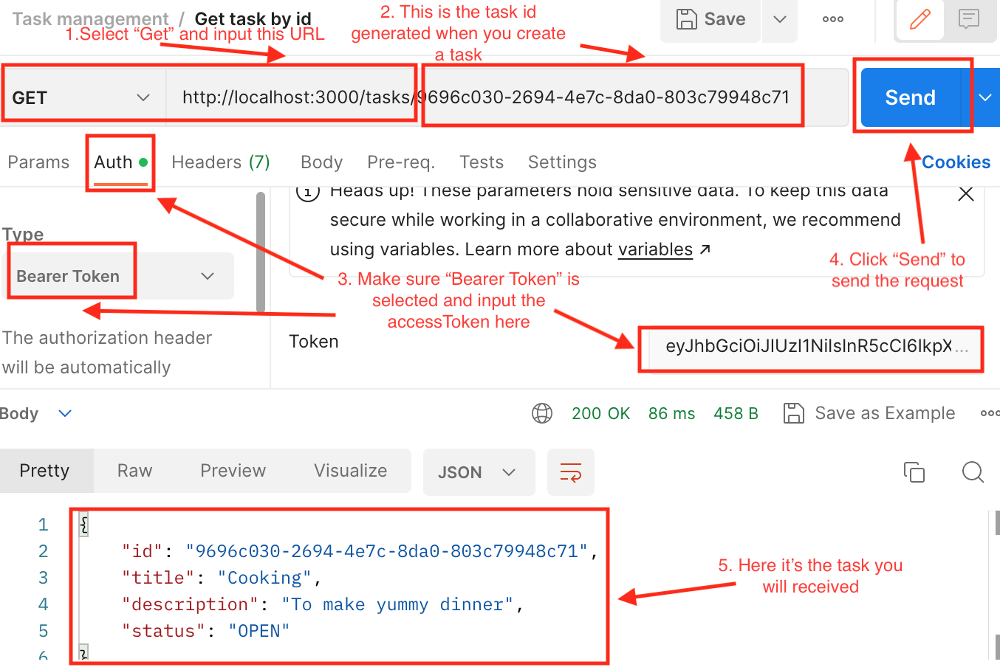

## Description
This is a task-manager application to demonstrate the backend technologies, including NestJS, Typescript, TypeORM, and Postgres.

This is a backend application without frontend, which has been allowed by the lecturer. There are several things that you will need to install and download before test this application. Please follow the instruction. 
## Installation
#### 1. Install Node.js
If you have not used Node.js before. You can simply download Node.js from [here](https://nodejs.org/en). 

#### 2. Install Yarn
It is recommended to install Yarn through the npm package manager, which comes bundled with Node.js when you install it on your system.
```bash
npm install --global yarn
```
You can find out more on yarn official website and how to install it. [here](https://classic.yarnpkg.com/en/docs/install/#mac-stable).

Check that Yarn is installed by running:
```bash
yarn --version
```
#### 3. Install Docker
We are going to use Docker to run Postgres. It is easy, straight-forward and it works cross-platform. You will need to install Docker on your machine.

You can find detailed instructions on how to install Docker for your operating system in the official Docker download page [here](https://classic.yarnpkg.com/en/docs/install/#mac-stable). 

To check that Docker is installed, you can run:
```bash
Docker
```

#### 4. Install pgAdmin
pgAdmin is going to help us manage and observe our Postgres database. This tool is cross-platform. You can find detailed download instructions in the official pgAdmin download page. [here](https://www.pgadmin.org/download/)

#### 5. Install Postman
Postman is going to help us test our API. This tool is cross-platform. You can find detailed download instructions in the official Postman download page. [here](https://www.postman.com/downloads/)

## Configuration
#### 1. Docker

If you have Docker installed, run the following command:
```bash
docker run --name postgres-nest -p 5432:5432 -e POSTGRES_PASSWORD=postgres -d postgres
```
In the command above, "run" means I want to run a container, "postgres-nest" is the name of the container, "-p" is the port mapping, "-e" is the environment variable,it set the POSTGRES_PASSWORD to postgres, "-d" is the detached mode, which means if you close the terminal, the container is going to keep running, and "postgres" is the actual container name.

#### 2. pgAdmin
a) Open your pdAdmin, when you firstly open it, you might need to set a password. Then you will see a "Severs" tag on your left hand menu, it is empty for now. Right click "Servers" and select "Register" -> "Server".


b) Then you can give the server a name. For example: 


c) After that, you can click the "Connection" button and do the following settings (The Password is the same as the one you set in the Docker command above, which should be "postgres"):


d) After that, you can click the "Save" button and you will see the server you just created in the "Servers" tag on your left hand menu.

## Testing
#### 1. Start the app
Assume that you have all the tools installed, configured and running. You can run the following commands to test the application:

```bash
yarn start:dev
```

If you see something like this in your terminal, that means the app is running successfully


#### 2. Test the app
a) To test the application, please open Postman and click "Collection" -> "Create a new collection". Then you can give the collection a name, for example: "Task Management". For example: 


b) To make a new request on Postman


c) The first functionality is to sign up and create a user. You can follow the steps to create a user:


**The username should be at least 4 characters long and a maximum 20 characters, and the password should be at least 8 characters long and a maximum 20 characters. In addition, the password need to contain at least one uppercase letter, one lowercase letter, and one digit or special character, and is at least 8 characters long.**
If the requirements are not met, it will return the error message "password too weak".

d) The second functionality is to sign in and get the token. You can follow the steps to get the token (Please save the token for the next steps):


e) The third functionality is to create a task. You can follow the steps to create a task (You will need the token from the previous step):


As you can see an ID is generated for the task, you will need to use this for the next test. 

f) The fourth functionality is to get task by ID.


g) The fifth functionality is to get all tasks.
Similar step f, you will need to use the token to get all tasks. The result will be like this:


h) The sixth functionality is to delete a task by id.


i) The seventh functionality is to update a task by id. 

**There are three legal task statuses, which are OPEN, IN_PROGRESS, and DONE**

